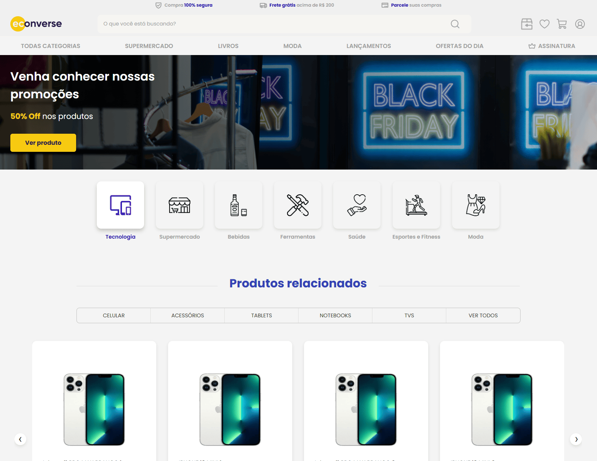

# 🚀 Teste Front-End - Econverse

Este projeto foi desenvolvido como parte do processo seletivo para a vaga de **Desenvolvedor Front-End** na **Econverse**. A proposta consiste em construir uma página de e-commerce responsiva, com componentes reutilizáveis, modal de produto e vitrine dinâmica.

---

## 📸 Preview do Projeto



---

## 🛠 Tecnologias Utilizadas

- **HTML5** semântico
- **TypeScript**
- **SCSS (Sass)** para estilização modular
- **Componentização com JavaScript/TS**
- **Modal dinâmico** para exibição de detalhes do produto
- **Carrossel de produtos** com navegação

---

## 📁 Estrutura de Pastas

```bash
src/
├── assets/         # Imagens e ícones
├── components/     # Componentes reutilizáveis
├── pages/          # Página principal
├── styles/         # SCSS modular
├── index.html      # Ponto de entrada da aplicação
└── App.tsx         # Componente raiz
```


---

## ⚙️ Como Rodar o Projeto

### 1. Clone o repositório

```bash
git clone https://github.com/RodrigoStukas/econverse-front-end.git

npm install #Instale as dependências

npm start #Inicie o servidor de desenvolvimento

npm run dev   # Inicia o projeto em modo desenvolvimento (se aplicável)
npm run build # Gera versão otimizada para produção (se aplicável)
 ```

---

## 🧩 Funcionalidades Implementadas

✅ Modal de produto com informações detalhadas

✅ Vitrine principal e secundária com carrossel de navegação

✅ Seção de categorias com hover interativo

✅ Botão "Ver produto" que abre o modal

✅ Rodapé funcional com banners promocionais

## 👨‍💻 Autor

Feito com 💙 por Rodrigo

## 📄 Licença

Este projeto é apenas para fins de avaliação técnica e não possui licença comercial.